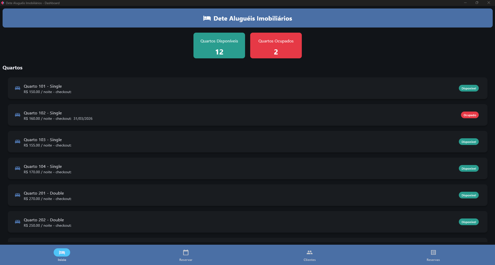
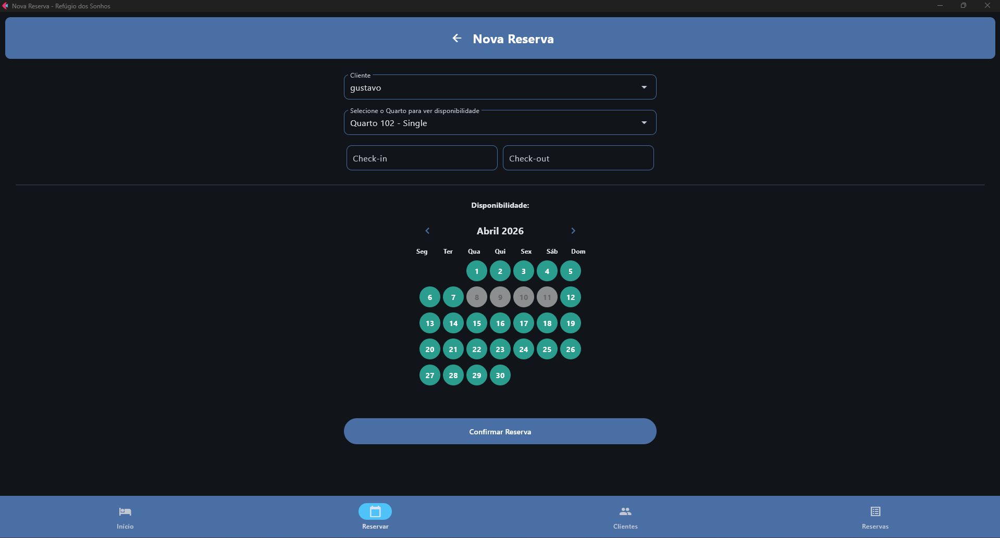
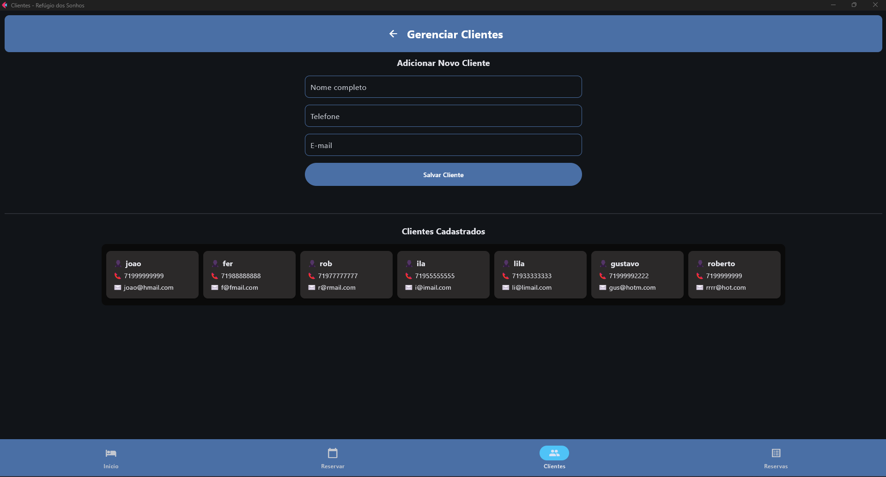
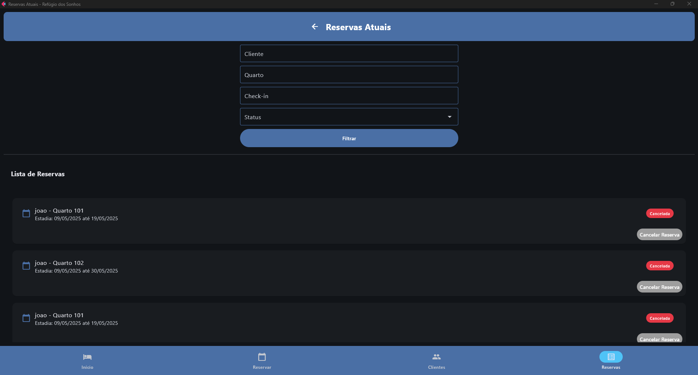

# 🏨 Sistema de Reservas - Refúgio dos Sonhos

Sistema de gerenciamento de reservas para hotel desenvolvido em Python, com interface gráfica utilizando Flet e persistência de dados com MySQL.

---

## 📌 Descrição

Aplicação que permite gerenciar clientes, quartos e reservas de forma simples e eficiente. O sistema conta com seleção de datas via DatePicker e valida automaticamente conflitos, garantindo que não existam reservas sobrepostas.

---

## 🚀 Funcionalidades

* ✅ Cadastro de clientes
* ✅ Listagem de quartos disponíveis
* ✅ Criação de reservas
* ✅ Seleção de datas com DatePicker
* ✅ Validação de conflito de datas
* ✅ Cancelamento de reservas
* ✅ Visualização de reservas

---

## 🛠️ Tecnologias

* Python
* Flet
* MySQL
* MySQL Connector
* Programação Orientada a Objetos (POO)

---

## 📂 Estrutura do Projeto

```id="s9xv3z"
projeto-hotel/
│
├── models/
│   ├── cliente.py
│   ├── quarto.py
│   ├── reserva.py
│   └── gerenciador.py
│
├── database/
│   └── conexao.py
│
├── main.py
└── README.md
```

---

## ▶️ Como Executar

1. Clone o repositório:

```id="l4qv9g"
git clone https://github.com/seu-usuario/seu-repo.git
```

2. Crie o ambiente virtual:

```id="j4m7xt"
python -m venv .venv
```

3. Ative o ambiente:

```id="8q5n2d"
.venv\Scripts\activate
```

4. Instale as dependências:

```id="y4n1kz"
pip install flet mysql-connector-python
```

5. Configure o banco de dados MySQL

6. Execute o projeto:

```id="0q2p3m"
python main.py
```

---

## 📸 Demonstração

### Tela Inicial


### Reserva


### Clientes


### Reservas


---

## 👨‍💻 Autor

Roberto Siquara

---

## ⭐

Se gostou do projeto, deixe uma estrela ⭐ no repositório!
****
